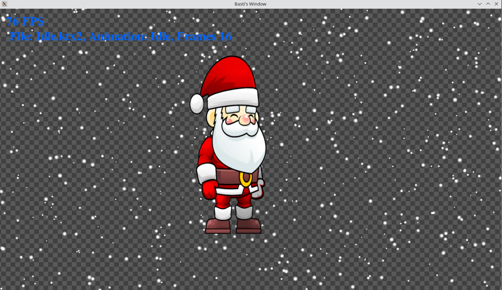

# OpenGL Sprite Animation Demo




A modern C++23 OpenGL engine demonstrating sprite animation, 3D glTF rendering, Lua scripting, and a fully modular static-library architecture. All subsystems are decoupled, RAII-compliant, and built with OpenGL 4.6 Direct State Access.

---

## ✨ Features

- **Modular Architecture**: Every subsystem is a standalone C++23 static library (`bgl_gfx`, `bgl_io`, `bgl_audio`, `bgl_windowing`, `bgl_gltf`, `bgl_text`, `bgl_script`). The application executable only links these — it compiles nothing itself beyond `Application.cpp`, `main.cpp`, and `Character.cpp`.
- **Modern Graphics Pipeline**: Strict OpenGL 4.6 Direct State Access (DSA) throughout — no legacy `glBind*` state machine usage.
- **glTF 3D Rendering**: Full glTF/GLB scene graph loader (`bgl_gltf`) using `fastgltf` with mmap-based buffer loading, Phong shading, and an infinite procedural XZ grid.
- **3D Camera**: Orbit camera (`glm::lookAt` + `glm::perspective`) with GLFW scroll/cursor/mouse-button callbacks for zoom, orbit, and pan.
- **Lua Scripting Engine**: Embedded Lua 5.4 via sol2, accessible through `bgl::script::ScriptEngine`. A startup script runs before the engine loop and can optionally load `assets/startup.lua` from disk.
- **RAII Resource Management**: All OpenGL objects (textures, VAOs, programs, buffers) are owned by RAII wrappers. No manual `delete`/`glDelete` in application logic.
- **Safe Randomness**: All particle and item placement uses `std::mt19937` seeded from `std::random_device` — no `std::rand()`.
- **Physics & Animation States**: Character physics (gravity, velocity, collision) with state-driven animation transitions (Idle, Walk, Jump).
- **Polymorphic Texture Loaders**: `bgl::io::ITextureLoader` supports KTX2 (Basis Universal), PNG, and JPEG, all uploaded to `GL_TEXTURE_2D_ARRAY`.
- **OpenAL Audio Engine**: Procedural audio synthesis for background music and jump sound effects.
- **HarfBuzz Text Rendering**: Advanced Unicode text shaping with a FreeType/Fontconfig backend.
- **SPIR-V Shaders**: Pre-compiled SPIR-V shaders loaded via `glShaderBinary` (OpenGL 4.6 / `GL_ARB_gl_spirv`).
- **GPU Animation Tweening**: Frame-to-frame interpolation performed in-shader on `sampler2DArray` textures.

---

## 🗂️ Module Layout

| Library | Location | Description |
|---|---|---|
| `bgl_gfx` | `src/gfx/` | Core OpenGL objects: textures, quads, camera, tilemap, HUD, GL context |
| `bgl_io` | `src/io/` | Texture and shader loaders (KTX2, PNG, JPEG, GLSL, SPIR-V) |
| `bgl_audio` | `src/audio/` | OpenAL audio engine, sound buffers, sound sources |
| `bgl_windowing` | `src/windowing/` | GLFW window, input handler, EnTT event dispatch |
| `bgl_gltf` | `src/gltf/` | glTF scene graph, loader, renderer, infinite grid, 3D camera |
| `bgl_text` | `src/gfx/text/` | FreeType + HarfBuzz text shaping, texture atlas, text renderer |
| `bgl_script` | `src/script/` | Lua 5.4 scripting engine via sol2 |

---

## 🛠️ Tech Stack

- **Language**: C++23
- **Graphics API**: OpenGL 4.6 (Core Profile, DSA, SPIR-V)
- **Windowing & Input**: GLFW 3.4
- **Dependencies**:
  - `glad`: OpenGL 4.6 loader
  - `glm`: OpenGL Mathematics
  - `ktx`: KTX2 & Basis Universal transcoder
  - `fastgltf`: High-performance glTF 2.0 parser with mmap support
  - `lua` 5.4 / `sol2`: Embedded Lua scripting
  - `stb`: Texture packing utilities
  - `fontconfig` / `freetype` / `harfbuzz`: Font resolution and text shaping
  - `spdlog` / `fmt`: Fast structured logging and string formatting
  - `nlohmann_json`: JSON asset configuration parsing
  - `entt`: Event dispatching
  - `openal-soft`: Cross-platform audio
- **Build Automation**:
  - `CMake 3.20+` with Presets
  - `Conan 2.x` with `conan.lock`
  - `Taskfile`

---

## 🚀 Getting Started

### Prerequisites

- GCC 13+ or Clang 16+ (C++23 required)
- `CMake` 3.20+
- `Conan` 2.x
- `Taskfile` (`task`)

### Setup & Build

```bash
# 1. Install all Conan dependencies (respects conan.lock for reproducibility)
task setup

# 2. Compile shaders and build all static libraries + executable
task build

# 3. Launch
task run
```

Or manually:

```bash
conan install . --output-folder=build --build=missing -s build_type=Debug
cmake --preset conan-debug
cmake --build --preset conan-debug
```

---

## 🎮 Controls

| Input | Action |
|---|---|
| `TAB` | Switch between loaded characters |
| `Arrow Left` / `Arrow Right` | Move character (triggers Walk animation) |
| `Space` | Jump (triggers Jump animation with gravity) |
| `Mouse drag (LMB)` | Pan 2D camera |
| `Scroll wheel` | Zoom in / out |
| `R` | Reset camera to origin |
| `ESC` / `Ctrl+C` | Clean shutdown |

---

## 📜 Lua Scripting

A Lua scripting engine is integrated at startup. An inline script runs automatically; an optional `assets/startup.lua` is loaded from disk if present:

```lua
-- assets/startup.lua
bgl.log("Startup script running.")
bgl.log("Engine version: " .. bgl.version())
```

Available Lua API:

| Function | Description |
|---|---|
| `bgl.log(msg)` | Log a message via spdlog at INFO level |
| `bgl.version()` | Return engine version string |

---

## 📜 License

This project is licensed under the MIT License. See the [LICENSE](LICENSE) file for details.